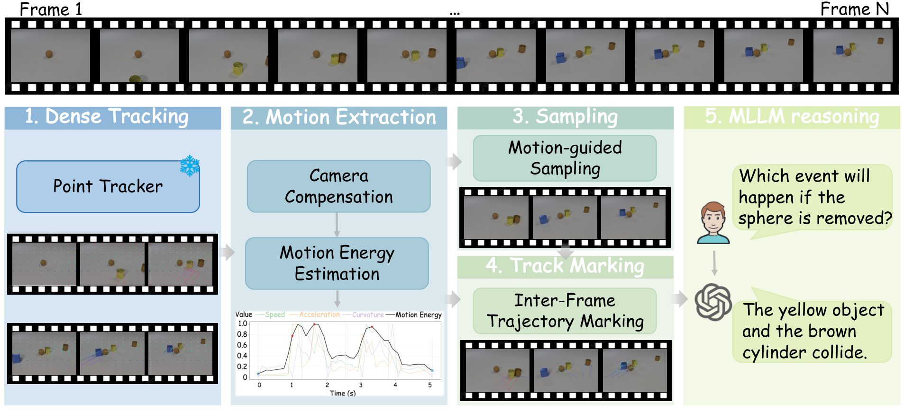
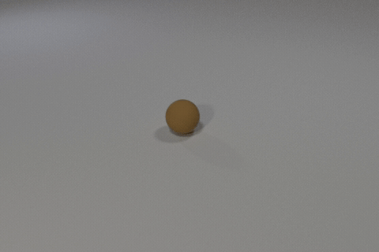
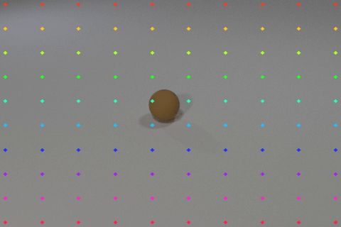
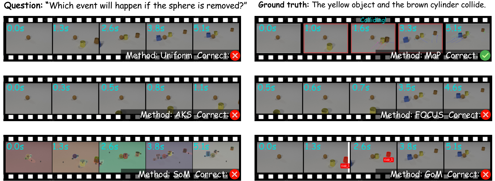

# Motion-as-Prompt (MaP)

### Enhancing Motion Reasoning in Multimodal LLMs via Motion-Guided Cross-Frame Visual Prompting

<p align="center">
  <br>
  <em>Framework overview: motion extraction → motion-guided sampling → inter-frame trajectory marking.</em>
</p>

MaP is a **training-free, plug-and-play** framework that recovers the inter-frame motion discarded by sparse video sampling and re-injects it into a **frozen** MLLM as visual prompts.
No weights are trained, and no model architecture is modified.

Multimodal LLMs typically watch a video through a handful of uniformly sampled frames to keep visual-token and attention costs manageable.
This turns a continuous motion process into a few disconnected snapshots, so collisions, direction changes, and accelerations that happen *between* sampled frames become invisible — we call this **inter-frame motion loss**.
MaP fixes this on the input side, with three lightweight stages:

1. **Motion signal extraction** — a frozen point tracker recovers dense trajectories from the full-frame-rate video; camera self-motion is removed, and the residual object motion is aggregated into a per-frame *motion-energy* curve `M(t)`.
2. **Motion-guided sampling** — under the *same* frame budget as uniform sampling, frames are re-allocated toward motion-informative moments, while uniform *anchors* preserve temporal coverage.
3. **Inter-frame trajectory marking** — the motion accumulated *between* consecutive sampled frames is drawn directly onto the frames as Set-of-Marks-style overlays, making displacement, direction changes, and interactions observable to a frozen MLLM.

Everything runs on a **single GPU with a ~98 MB tracker** and adds only a few hundred milliseconds of preprocessing per video — orders of magnitude cheaper than motion-token-fusion approaches that require training.

<table align="center">
  <tr>
    <td align="center"></td>
    <td align="center"></td>
  </tr>
  <tr>
    <td align="center"><em>Original video</em></td>
    <td align="center"><em>Recovered point trajectories (what MaP feeds the MLLM)</em></td>
  </tr>
</table>

<p align="center">
  <br>
  <em>Qualitative comparison: MaP vs. baseline frame-selection / visual-prompting methods.</em>
</p>


---

## Highlights

- **Training-free & model-agnostic.** Works with any frozen MLLM; we validate on a local open model (Qwen3-VL-2B) and a remote OpenAI-compatible model (GPT-5.5).
- **Equal-budget comparison.** MaP and the uniform baseline always use the same number of frames — the only variables are *which* frames and *what* marks — so gains are not from simply seeing more frames.
- **Consistent gains on motion reasoning** with no degradation on general video reasoning (verified on TempCompass).


---
## Repository layout

```
MaP/
├── map_kit/
│   ├── core/                        # the three MaP stages + orchestrator
│   │   ├── motion_energy.py         #   camera-compensated motion energy M(t)   [Stage 1]
│   │   ├── frame_selector.py        #   motion-guided sampling (anchors + NMS)   [Stage 2]
│   │   ├── track_marker.py          #   inter-frame trajectory marking           [Stage 3]
│   │   └── pipeline.py              #   end-to-end orchestrator (MotionAdaptiveSampler)
│   ├── models/                      # frozen MLLM wrappers
│   │   ├── qwen_infer.py            #   Qwen3-VL wrapper + interleaved <t.t seconds> prompt
│   │   └── gpt_client.py            #   OpenAI-compatible vision client (endpoint via env var)
│   ├── data/                        # video I/O, tracker, and dataset construction
│   │   ├── video_io.py              #   full-frame-rate reading, budget rules, temporal windows
│   │   ├── cotracker_runner.py      #   frozen point-tracker wrapper (offline + streaming)
│   │   ├── ssv2_data.py             #   SSv2 4-way-MC dataset adapter
│   │   ├── ssv2_val_subset.json     #   SSv2 demo sample
│   │   └── extract_prereseed_tracks.py  # re-seeding diagnostics
│   └── benchmarks/                  # runners, evaluation, and analysis
│       ├── run_{mvbench,tempcompass,ssv2}*.py   # benchmark runners (local + remote)
│       ├── merge_*.py / score_mvbench.py        # shard merge & leaderboard
│       └── significance.py                      # paired McNemar + bootstrap 95% CI
├── scripts/                        # multi-GPU sharding launchers
│   ├── run_mvbench_parallel.sh      #   CLEVRER (MVBench five tasks)
│   ├── run_ssv2_parallel.sh         #   Something-Something-v2 (4-way MC)
│   └── run_tempcompass_parallel.sh  #   TempCompass (general video reasoning)
├── asset/                          # figures (overview/compare .png) + demo GIFs
├── requirements.txt
├── .gitignore
└── README.md
```

---

## Notes on paths

Default paths inside the runners and `scripts/*.sh` use `/path/to/...` placeholders and can be overridden with command-line flags (`--cotracker_ckpt`, `--video_root`, `--mvbench_root`, …) or environment variables.
Adjust them to your local setup.

---

## Installation

```bash
git clone <this-repo>
cd MaP
pip install -r requirements.txt
```

You additionally need:

- **CoTracker3** (the frozen point tracker) installed from its official repository [facebookresearch/co-tracker](https://github.com/facebookresearch/co-tracker), plus its checkpoint. Point `--cotracker_ckpt` at the checkpoint (`.pth`).
- **Qwen3-VL-2B-Instruct** weights (for the local runners), via HuggingFace.

### Datasets

Download the three benchmarks and point the runners at them (`--mvbench_root`, `--video_root`, `--data_path`):

- **CLEVRER** (via MVBench): [OpenGVLab/MVBench](https://huggingface.co/datasets/OpenGVLab/MVBench)
- **Something-Something-v2**: [HuggingFaceM4/something_something_v2](https://huggingface.co/datasets/HuggingFaceM4/something_something_v2)
- **TempCompass**: [lmms-eval/TempCompass](https://huggingface.co/datasets/lmms-eval/TempCompass)

### Remote model configuration (no credentials in the repo)

The OpenAI-compatible client reads its endpoint and key from environment variables — **no API keys or provider URLs are stored in this repository**:

```bash
export MAP_BASE_URL="https://<your-openai-compatible-endpoint>/v1/chat/completions"
export MAP_API_KEY="<your-token>"
export MAP_MODEL="GPT-5.5"   # optional; defaults to GPT-5.5
```

---

## Quick start

Adaptively sample the motion-informative frames of a single video:

```python
from map_kit import MotionAdaptiveSampler

sampler = MotionAdaptiveSampler(cotracker_ckpt="/path/to/cotracker.pth")
res = sampler.sample("video.mp4", budget=16)   # equal-budget vs. uniform
res.frames        # (B, H, W, 3) selected key frames
res.timestamps    # (B,) true non-uniform seconds for the prompt
```

Draw the inter-frame trajectory marks and build the interleaved prompt:

```python
from map_kit.core.track_marker import select_object_tracks, draw_marks_on_frames, legend_text

groups = select_object_tracks(res.tracks, res.visibility, res.obj_vel, hw=res.frames.shape[1:3])
marked = draw_marks_on_frames(res.frames, res.indices, groups, res.timestamps, span="frame")
legend = legend_text(len(groups))
```

---

## Evaluate benchmarks

MaP is evaluated on three benchmarks. All runners use the same option-letter / rule-based scoring as the original tasks.

The local `scripts/*.sh` launchers default to the paper configuration, so a plain `adaptive` run reproduces the reported setting without extra flags. When trajectory marking is on, marks are fixed to **points** selection + **frame** span + single per-point color, and tracking runs with **`segment_track` enabled (offline, frame-aligned per-interval tracking)** — the setting the paper uses for inter-frame marking. `segment_track` and streaming (`online`) are mutually exclusive; the scripts keep `segment_track` on and `online` off by default.

Positional arguments (all optional except the first two):

```
run_mvbench_parallel.sh     <mode> <model> [tag] [task]  [workers] [draw_tracks] [online] [grid_size] [segment]
run_ssv2_parallel.sh        <mode> <model> [tag]         [workers] [draw_tracks] [online] [grid_size] [segment]
run_tempcompass_parallel.sh <mode> <model> [tag] [task]  [workers]              [online] [segment] [grid_size]
```

Defaults: `draw_tracks=on` (MVBench, SSv2) / `off` (tempCompass), `online=off`, `grid_size=10`, `segment=on`.

**CLEVRER** (five MVBench sub-tasks) on Qwen3-VL, adaptive vs. uniform at equal budget:

```bash
bash scripts/run_mvbench_parallel.sh adaptive <qwen3vl_ckpt> map-clevrer-adaptive all 1
bash scripts/run_mvbench_parallel.sh uniform  <qwen3vl_ckpt> map-clevrer-uniform  all 6
python -m map_kit.benchmarks.score_mvbench --output_path predictions/map-clevrer-adaptive
```

**Something-Something-v2 (SSv2)** — a deterministic 4-way multiple-choice subset (object references abstracted to *"something"*, with hard-negative near-synonym distractors).

```bash
bash scripts/run_ssv2_parallel.sh adaptive <qwen3vl_ckpt> map-ssv2-adaptive 1
```

**TempCompass** — used to confirm that motion-guided sampling does not degrade general (non-motion) video reasoning:

```bash
bash scripts/run_tempcompass_parallel.sh adaptive <qwen3vl_ckpt> map-tempcompass-adaptive
```

**Remote model (GPT-5.5).** The GPT runners are invoked directly with `python -m` (no sharding script needed — GPT calls are HTTP-bound and run in a thread pool). Configure the endpoint via the env vars above.

Below are all six commands: two modes (`uniform` baseline vs. MaP `adaptive`+marks) across the three benchmarks.
The `uniform` baseline is pure HTTP with no local GPU (no CoTracker, no marking); the MaP mode does local-GPU motion-guided sampling + trajectory marking, then sends the marked frames to the endpoint.

```bash
# ── CLEVRER (MVBench five tasks) ───────────────────────────────
# uniform baseline (dedicated HTTP-only runner)
python -m map_kit.benchmarks.run_mvbench_gpt --task all
# MaP: adaptive sampling + trajectory marks
python -m map_kit.benchmarks.run_mvbench_gpt_adaptive --mode adaptive --task all

# ── SSv2 (4-way MC) ────────────────────────────────────────────
# uniform baseline (same runner, marks off + uniform frames)
python -m map_kit.benchmarks.run_ssv2_gpt_adaptive --mode uniform --no_tracks
# MaP: adaptive sampling + trajectory marks
python -m map_kit.benchmarks.run_ssv2_gpt_adaptive --mode adaptive

# ── TempCompass (general video reasoning; frame selection only, no marks) ──
# uniform baseline
python -m map_kit.benchmarks.run_tempcompass_gpt --mode uniform --task_type multi-choice
# adaptive motion-guided sampling
python -m map_kit.benchmarks.run_tempcompass_gpt --mode adaptive --task_type multi-choice
```

Notes:
- CLEVRER has a dedicated `run_mvbench_gpt` for the uniform baseline; SSv2 reuses `run_ssv2_gpt_adaptive` with `--mode uniform --no_tracks`.
- TempCompass is a frame-selection-only check (no trajectory marks in either mode), so both modes use the same `run_tempcompass_gpt` runner; pass `--task_type` for each of its tasks (`multi-choice`, `yes_no`, `caption_matching`, `captioning`).
- All GPT runners accept `--refill_empty` to re-query and back-fill any empty completions (see the note on GPT-5.5's large `--max_new_tokens` requirement), and `--no_timestamps` to drop the interleaved `<t.t seconds>` tokens.

Paired statistical significance of MaP vs. uniform (McNemar + bootstrap 95% CI):

```bash
python -m map_kit.benchmarks.significance \
    --sys_a predictions/<map_run> --sys_b predictions/<uniform_run> \
    --task object_existence,moving_direction,moving_count,moving_attribute,counterfactual_inference
```


---

## Citation

If you find MaP useful, please cite our paper (see `CITATION` once released)：
```bash
@misc{sun2026motionaspromptenhancingmotionreasoning,
      title={Motion-as-Prompt: Enhancing Motion Reasoning in Multimodal Large Language Models via Motion-Guided Cross-Frame Visual Prompting}, 
      author={Xikai Sun and Kebin Liu and Haotian Wang and Li Liu and Xu Wang and Yunhao Liu},
      year={2026},
      eprint={2608.11655},
      archivePrefix={arXiv},
      primaryClass={cs.CV},
      url={https://arxiv.org/abs/2608.11655}, 
}
```

